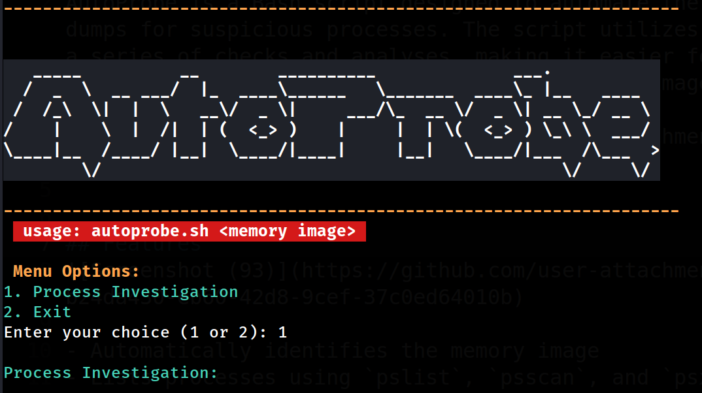
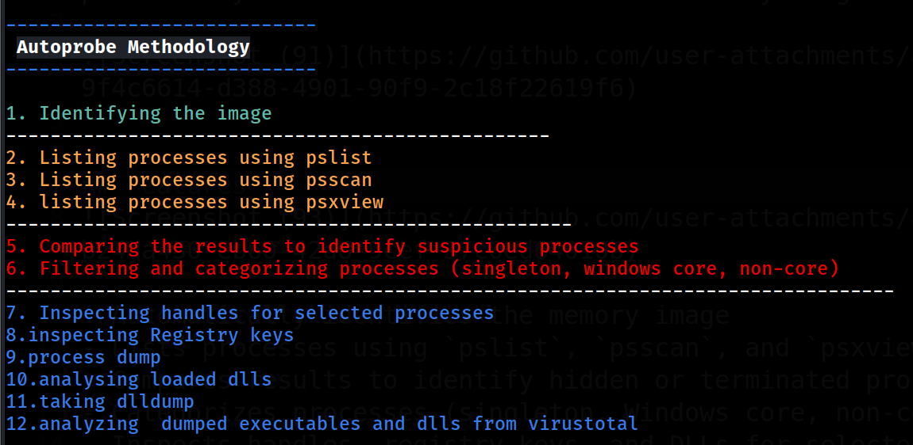

# AutoProbe: Memory Forensics Automation Script
AutoProbe is a Bash script designed to automate the process of investigating memory dumps for suspicious processes. The script utilizes the Volatility framework to perform a series of checks and analyses, making it easier for forensic analysts to identify potentially malicious activities within memory images.



# Features


- Automatically identifies the memory image
- Lists processes using `pslist`, `psscan`, and `psxview`
- Compares results to identify hidden or terminated processes
- Categorizes processes (singleton, Windows core, non-core)
- Inspects handles, registry keys, and DLLs for selected processes
- Dumps processes and analyzes loaded DLLs
- uses virustotal for scanning dumped processes hashes


 ## **PREREQUISITES**

## Installing Volatility Standalone on Linux

To install the standalone version of Volatility on Linux, follow these steps:

1. ## **Download the Standalone File**

   Go to the [Volatility 2.6.1 release page](https://github.com/volatilityfoundation/volatility/releases/tag/2.6.1) and download the standalone file for Linux.

2. ## **Unzip the File**

     **Unzip the downloaded file. You can use the `unzip` command in the terminal:**


  
3.  ## **Rename the Standalone File**

    `mv <filename> volatility`
 
4. ## **move the file to /usr/bin**

    `sudo mv volatility /usr/bin`

5. ## `xdot` must be installed for visualizing process trees**


## Usage

1. Clone the repository:
    ```bash
    git clone https://github.com/yourusername/autoprobe.git
    cd autoprobe
    ```

2. Make the script executable:
    ```bash
    chmod +x autoprobe.sh
    ```

3. Run the script with a memory image:
    ```bash
    ./autoprobe.sh <memory image>
    ```

    Replace `<memory image>` with the path to your memory dump file.


## Example Output

The script saves results and dumped files in the following directories:
- `results`: Contains scan results and analysis output
- `dump`: Contains dumped processes and DLLs

## Contributing

Contributions are welcome! Please fork the repository and create a pull request with your changes. For major changes, please open an issue to discuss what you would like to change.

## License

This project is licensed under the GNU License. 


